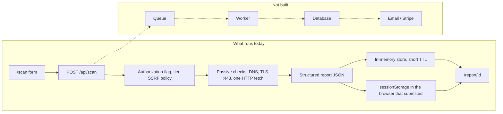

# Scan pipeline

v1 runs the passive scan inside the Next.js route that received the request. A queue and a worker are drawn below so the next backend has a place to land. They are not running.

## Request path

1. The visitor enters a URL, picks Basic, Standard, Advanced, or Full, and checks the authorization box.
2. `POST /api/scan` rejects the call unless `authorization` is `true`, the tier is known, and `parsePublicUrl` accepts the target.
3. Sockets resolve DNS through `safeLookup`. Private, loopback, link-local, and metadata addresses are refused. Only ports 80 and 443 are fetched. Redirects are checked again. Bodies are size-capped.
4. The report builder turns observations into findings. A check that did not finish is `pending`. Work that would be active or authenticated is `requires-engagement` and is not executed.
5. The report is kept in a process-local map for about two hours and returned to the browser. `/report/[id]` reads the map, then the browser's `sessionStorage`.

## What a future worker would add

A signed job (`SCAN_WORKER_SECRET`) would carry the same validated target and tier. The worker would run the same passive checks, write the report to `DATABASE_URL`, and optionally mail it. Active tests would still require a separate human scope. They do not move to the worker just because a queue exists.

See `docs/SOURCE_OF_TRUTH.md` for the product boundary and the decisions still open.
